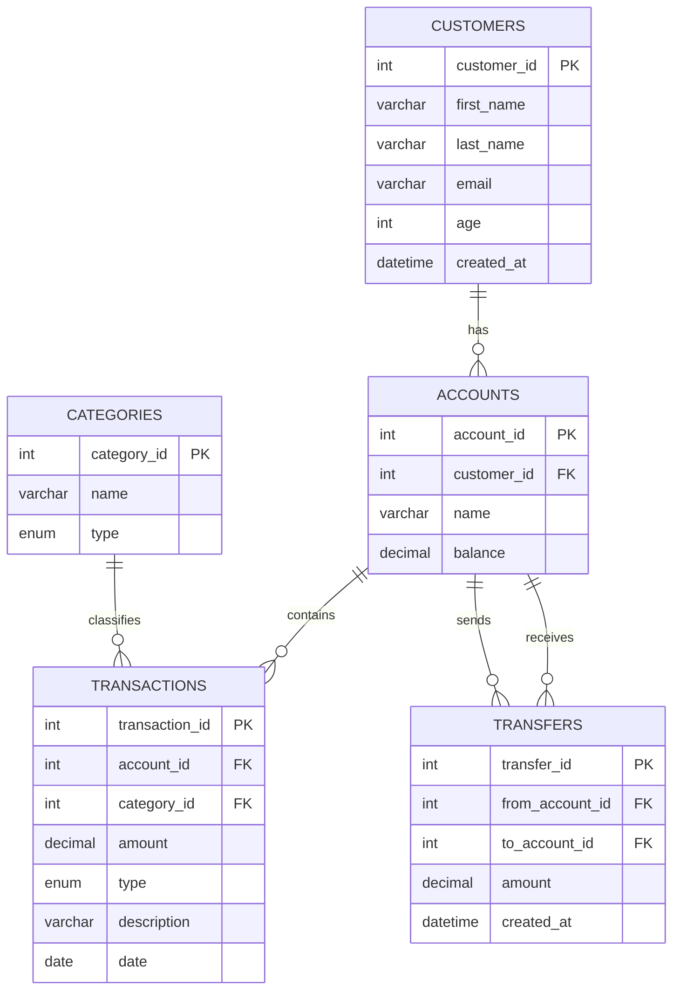

# ER Diagram - Personal Finance Tracker

```mermaid
erDiagram
    CUSTOMERS {
        int customer_id PK
        varchar first_name
        varchar last_name
        varchar email
        int age
        datetime created_at
    }

    CATEGORIES {
        int category_id PK
        varchar name
        enum type
    }

    ACCOUNTS {
        int account_id PK
        int customer_id FK
        varchar name
        decimal balance
    }

    TRANSACTIONS {
        int transaction_id PK
        int account_id FK
        int category_id FK
        decimal amount
        enum type
        varchar description
        date date
    }

    TRANSFERS {
        int transfer_id PK
        int from_account_id FK
        int to_account_id FK
        decimal amount
        datetime created_at
    }

    CUSTOMERS ||--o{ ACCOUNTS : "has"
    ACCOUNTS ||--o{ TRANSACTIONS : "contains"
    CATEGORIES ||--o{ TRANSACTIONS : "classifies"
    ACCOUNTS ||--o{ TRANSFERS : "sends"
    ACCOUNTS ||--o{ TRANSFERS : "receives"
```
